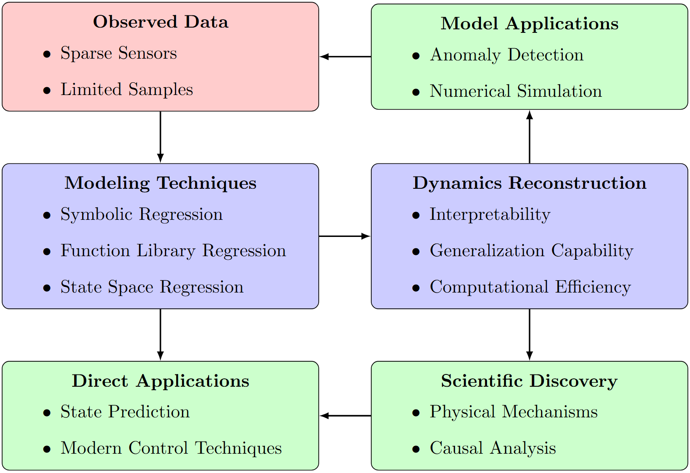
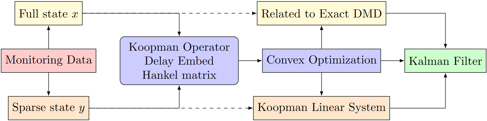
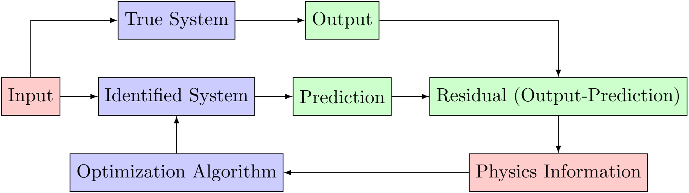
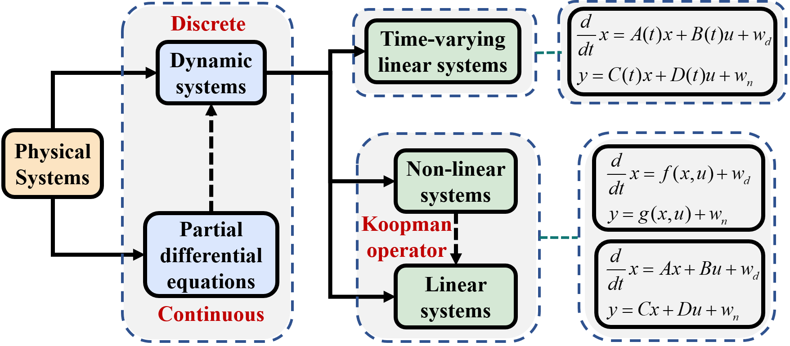
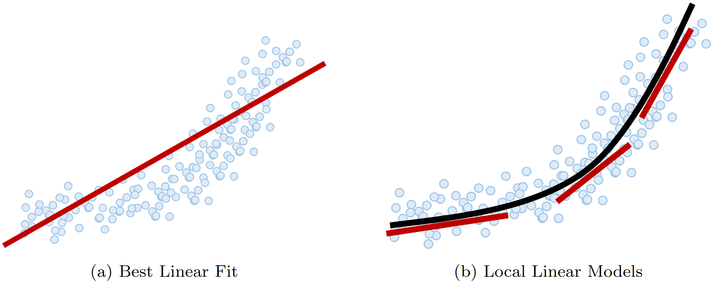

# Table of Contents
* [Personal Academic Research Introduction](#personal-academic-research-introduction)
* [Some Thoughts on the Research Areas/Methods/Theories I Am Currently Pursuing](#some-thoughts-on-the-research-areasmethodstheories-i-am-currently-pursuing)
* [Key Research Directions and Technical Approaches](#key-research-directions-and-technical-approaches)
* [References](#References)

---

# Personal Academic Research Introduction

I am a PhD student at **Harbin Institute of Technology (Shenzhen)**, enrolled in September 2023. My email is 23B954005@stu.hit.edu.cn, and my Google Scholar profile can be found at [Google Scholar ](https://scholar.google.com.hk/citations?user=d9qEdQIAAAAJ&hl=zh-CN). If you are interested in the following areas of my research, please feel free to contact me if you are interested in collaborating or sharing insights on these topics.

My doctoral research focuses on **Structural Health Monitoring (SHM)**, a rapidly growing interdisciplinary field that integrates concepts from mechanics, aerospace engineering, civil engineering, control systems, and signal processing. The primary objective of SHM is to assess and continuously monitor the structural performance and state changes of engineering systems, with the main research subjects being mechanical systems, spacecraft, and transportation infrastructure. The primary goal is similar to health monitoring in medical devices, with the key difference being the subject of study.

Currently, my research is concentrated in the following key areas:

- **Data-driven system identification**: I am exploring methods for identifying the dynamics of structures using data, including both linear and nonlinear systems. This work aims to enhance the accuracy and reliability of system models by using available observational data.

- **Model order reduction**: This involves developing techniques to simplify complex system models without significantly compromising accuracy, allowing for more efficient simulations and real-time applications.

- **Online system state estimation**: My research also addresses the challenge of continuously estimating the state of a system in real-time using sensor data, which is crucial for proactive maintenance and performance evaluation.

- **Modal identification**: I focus on identifying the modal parameters of structures, such as natural frequencies and mode shapes, which are essential for understanding their dynamic behavior and health status.

The theoretical foundation of my work is based on the **Koopman operator** and **optimal estimation** techniques, rooted in applied mathematics and statistical signal processing. One focuses on solving nonlinear problems, while the other addresses robustness against noise. While these theories offer elegant mathematical frameworks, translating them into practical applications can be challenging due to the fact that real-world observation data is often discrete and typically lacks accurate prior physical information. 

In order to bridge the gap between theory and practice, I primarily employ **finite element models** to provide initial physical information, and then use **convex optimization methods** combined with data to correct the initially inaccurate physical model. By leveraging domain expertise, I formulate the corresponding optimization problems—specifically, **convex optimization problems**—and develop efficient convex optimization algorithms for application to real-world challenges in structural health monitoring.

The primary advantage of convex optimization in practical physical problems often lies in its ability to guarantee global optima. Specifically, a convex optimization problem (or program) is defined as follows:

$$
\begin{aligned}
\text{minimize}\quad & f(x) \\
\text{subject to}\quad & h_i(x) \le 0,\quad i = 1,\dots,m \\
& \ell_j(x) = 0,\quad j = 1,\dots,r
\end{aligned}
$$

where $f(x)$ and $h_i(x),\quad i=1,\dots,m$ are convex functions, and $\ell_j(x),\quad j=1,\dots,r$ are affine functions.
Based on duality theory, when strong duality holds, an equivalent formulation can be derived through the Lagrangian. The Lagrangian for a given optimization problem is defined as:

$$
L(x, u, v) = f(x) + \sum_{i=1}^{m} u_i \, h_i(x) + \sum_{j=1}^{r} v_j \, \ell_j(x)
$$

where $u_i \geq 0$ for all $i$, reflecting the non-negativity constraint on the dual variables corresponding to the inequality constraints. For those who frequently work with machine learning and deep learning, such optimization formulations may be more familiar.

---
# Some Thoughts on the Research Areas/Methods/Theories I Am Currently Pursuing

## 1. **Data-driven System Identification**:  
System identification is an age-old subject with a wealth of research results. It can be classified from multiple perspectives—for instance, whether the system is stochastic or deterministic, linear or nonlinear, time-varying or not, and whether it incorporates physical information. Each classification method has its own emphasis, and overall, there is a rich accumulation of theoretical and practical experience.  However, when it comes to addressing real-world problems (especially in cases where ground truth is unavailable), these classifications can become ambiguous. 

For example, if a system is not highly nonlinear, a linear identification method may achieve acceptable performance as long as the error remains within tolerable limits. Similarly, in noise analysis, if the noise in the data is ignored and a deterministic system identification method is applied directly, the results might still be satisfactory if the noise level is low or due to other favorable factors. The real challenge lies in determining which method to choose under what circumstances, and in defining the influence of physical information and noise to select the most appropriate analytical strategy.  

From my perspective, I have been exploring how to use noisy data to estimate the dynamic characteristics of structures—aiming either to remove noise as much as possible or to achieve optimal estimation based on the statistical properties of the noise. This research encompasses both linear and nonlinear systems. For my own work, I have adopted a classification method based on the completeness of the state vector data, dividing the research issues into two main categories:

### **Complete State Vector Data**:  
  In some cases, the focus is on theoretical investigations or scenarios where obtaining experimental data is extremely challenging. For example, in the analysis of robot or UAV trajectory data, the cost of experiments can be high; similarly, repeated experiments on rare events like typhoons or earthquakes are practically infeasible. As a result, many studies rely on numerical simulation data based on physical laws to validate methods and theories.  
  - The pursuit of extracting physical laws from data has been a relentless human endeavor—from the ancient Kepler's three laws and Newton's second law to the current era of extensive data mining using machine learning algorithms. Common methods include symbolic regression, sparsity-based approaches, and modeling based on state-space equations.
  - Furthermore, certain complex problems (such as high-fidelity computational fluid dynamics simulations) involve data with extremely high dimensions. Due to limited computational resources, the sampling time steps are often short, resulting in a so-called "thin matrix." In such cases, **Model Order Reduction** is usually required—that is, developing techniques to simplify complex system models while maintaining acceptable accuracy for more efficient simulation and real-time applications.

  

### **Sparse State Vector Data**:  
  For real-world physical systems, sensor placements are often limited and the cost of long-term maintenance is high, so only a subset of the system’s states can be sampled. Although the sampling interval may be very short, the total sampling duration can be very long, leading to a "fat matrix." Moreover, even when complete state vector data is available, researchers often prefer to work with only a portion of the data to improve computational efficiency or reduce storage costs, and then later use techniques such as compressed sensing to recover the complete dataset. This scenario overlaps with the issues encountered in **Model Order Reduction**.

  

  

For my research in structural health monitoring, complete monitoring data is usually unavailable, and we must rely on sparse measurement data to infer changes in the structure's state. This data sparsity poses a number of challenges and issues:
  - The primary challenge lies in accurately identifying the system's characteristics from sparse and potentially incomplete data. With a limited number of measurement points, the data may not fully reflect the overall state of the structure, potentially introducing latent variables (i.e., the full state vector). This makes it very difficult to directly infer the structural state characteristics from partial data. In such cases, it is necessary to design more efficient and robust algorithms that can fully exploit the physical information and statistical properties embedded in the limited data.
  - When the sampling data spans a very long time period, even though each time instance may have few measurements, the overall dataset can become extremely large, forming what is known as a "fat matrix." In such scenarios, in addition to addressing the issue of data sparsity, one must also contend with computational efficiency challenges arising from the large volume of data. In particular, to capture the dynamic changes of the system within each time segment, efficient online system identification is required, which demands real-time data processing.

  

  

In summary, data-driven system identification—whether dealing with complete monitoring data or sparse sampling data—requires a combination of physical theory and statistical methods to design appropriate mathematical models, fully consider the impact of noise, and leverage modern optimization techniques and machine learning methods. My research is dedicated to tackling these fundamental scientific challenges, aiming to bridge the gap between theory and practice and to achieve more accurate and robust system identification results in real-world engineering applications.

## 2. **Optimal Estimation**

In practice, monitoring data is often contaminated by noise. To evaluate the statistical performance of estimators derived from such data, it is essential to model the noise. The estimation problem is mathematically formulated as determining parameters $\theta$ from a discrete dataset $\{x_0, x_1, \dots, x_N\}$, associated with a signal following a stochastic model $x \sim f(x, \theta)$

- **The Mathematical Estimation Problem** encompasses the challenge of inferring unknown parameters or system states from observational data.  
- **Digital computers** allow us to analyze sampled data, leading to the problem of estimating parameters from a discrete dataset.  
- **Parameter $\theta$** is deterministic in classical estimation and random in Bayesian estimation.

The aim is to find $\theta$ or construct an estimator $\hat{\theta}$ using the function $g$, expressed as:

$$
\hat{\theta} = g(x_0, x_1, \dots, x_N)
$$

Here, the function $g$ is designed to estimate the parameters $\theta$ from the data. Often, the main trick is finding the right mathematical formulation of your estimation problem:

- **Function**: $x \sim f(x, \theta)$ Identify the function that best represents the data or the system.

- **Metric**: $L(\theta, \hat{\theta})$ Choose a loss or cost function $L$ that quantifies the error or difference between the estimated parameters $\hat{\theta}$ and the true parameters $\theta$.

- **Constraints**: $R(\theta)$ Define any constraints $R$ that the parameters $\theta$ must satisfy. These could be physical constraints, regulatory requirements, or computational limitations.

Once the function, metric, and constraints are defined, the next step is to choose the best algorithms that exploit these definitions to solve the estimation problem effectively. 
Therefore, optimal estimation is a mathematical technique used to estimate the parameters, with the aim of achieving the most accurate estimation using available observation data, system models $f(x, \theta)$, metric $L(\theta, \hat{\theta})$, and constraints $R(\theta)$. 

The objective is to minimize the error quantified by the loss function, typically achieved through methods like least squares and Kalman filtering. Optimal estimation is widely used in dynamic systems for real-time state tracking and has broad applications in fields such as control systems, signal processing, and communications.
One commonly used loss function is the Mean Square Error (MSE), defined as:

$$
\text{MSE}_{\text{classical}}(\hat{\theta}) = E_x\Big[(\hat{\theta} - \theta)^2\Big] = \int (\hat{\theta} - \theta)^2  p(x)  dx,
$$

and

$$
\text{MSE}_{\text{Bayesian}}(\hat{\theta}) =  E\_{x,\theta}\Big[(\hat{\theta} - \theta)^2\Big]= \int (\hat{\theta} - \theta)^2 p(\theta,x)  d \theta dx
$$

The classical approach to MSE does not yield an optimal estimator since the true value of $\theta$ is unknown, making the calculation of the loss function impossible.
However, the Bayesian MSE provides a mechanism to obtain the optimal estimator through conditional expectation, taking into account prior knowledge and data.

$$
\hat{\theta} = E(\theta \mid x) = \int \theta \cdot p(\theta \mid x) \, d\theta.
$$

where

$$
p(\theta \mid x) = \frac{p(x \mid \theta) \, p(\theta)}{p(x)} = \frac{p(x \mid \theta) \, p(\theta)}{\int p(x \mid \theta) \, p(\theta) \, d\theta}.
$$

In recent years, however, this approach may have lost its prominence, largely due to the powerful nonlinear modeling capabilities of deep neural networks and the increasing computational support from companies like NVIDIA. Research focus has increasingly shifted toward deep learning. In such cases, analyzing the statistical performance of estimators becomes challenging. Nevertheless, I continue to analyze it through optimal estimation theory because, for certain applications, the well-established mathematical foundation of optimal estimation provides a robust framework for understanding and enhancing estimation accuracy.

---

# Key Research Directions and Technical Approaches

## 1. **System Identification Based on Stochastic Subspace Methods**
This approach originally stems from control theory, primarily relying on the orthogonality between the signal subspace and the noise subspace to eliminate noise and achieve high-precision system identification. By assuming the noise is white noise and that the system state vector and noise exhibit ergodic properties, this method guarantees convergence to the state-space equation estimate with completely removed noise when the monitoring data is infinite.

I apply this method to data-driven modeling of monitored structures, and it can also have broad applications in high-precision system modeling and signal processing. This approach enables the extraction of true system dynamics from noisy data, providing an effective solution for engineering problems that require precise identification and control.

## 2. **Nonlinear System Identification Based on Koopman Operator Theory**
This method relies on the Koopman operator theory, where the state vector of a dynamic system is mapped into a high-dimensional (and potentially infinite-dimensional) space, seeking a linear representation within that space. This approach is similar to Kernel methods, and I consider it an extension of classical linear state-space models. Since state-space equations can also be viewed as a method of mapping monitoring data into high-dimensional space, the entire process is linear, but the observation function of the Koopman operator can be arbitrary. Given its strong mathematical foundation, this method provides new ways to interpret the dynamic characteristics of systems and is well-suited for integration with control methods like Model Predictive Control (MPC).

I use it to solve some very complex system identification problems with highly nonlinear characteristics. It is highly effective in nonlinear system identification and is currently emerging as a popular and modern research topic. This method has proven highly effective for solving complex nonlinear systems that are difficult to address with traditional approaches. It provides a powerful tool for analyzing and controlling dynamic systems, with vast potential for real-world applications. Particularly in fields such as aerospace, robotics, and intelligent transportation, it holds great promise for advancing system identification and control strategies.

## 3. **Data-driven Model Order Reduction**  
Model order reduction is a popular research direction in fields such as computational fluid dynamics, especially in the context of high-dimensional fluid data generated from simulations. This technique effectively reduces computational load. However, for real-world sensor sampling systems, the ability to obtain high-dimensional data remains uncertain. Additionally, ensuring the generalization ability of data-driven reduction methods is still a major challenge, particularly under different boundary conditions and initial conditions.

In my research, I am focused on addressing how to apply data-driven reduction techniques in different physical environments and complex real-world conditions. This requires maintaining accuracy while adapting to various system settings. Therefore, a core issue in my research is developing effective data processing methods to reduce model complexity while ensuring the applicability and stability of the model.

## 4. **Online System State Tracking (Digital Twin Model)**  
Digital twin technology is one of the directions in my research that is closest to practical engineering applications. Structural health monitoring systems typically accumulate vast amounts of data, which contain important information about structural performance changes. Therefore, effectively extracting this potential structural performance information from the data is a key issue in my research. To achieve this, I primarily adopt **time-varying stochastic state-space models** rather than relying solely on deep learning. This approach helps better interpret the physical mechanisms behind the data, thereby improving the accuracy and reliability of the monitoring system. The completed work so far can be found here:

Structures are continuously subjected to the combined effects of external environments and loads over time, which inevitably leads to a gradual decline in their performance. The advantage of digital twin technology lies in its ability to integrate **time-varying stochastic state-space models** with real-time data, updating the structural state in real-time through simulation and feedback from the data, while predicting the future behavior of the structure. This method can effectively support decision-making in structural health monitoring, ensuring the safety and reliability of structures in complex environments.

  

It is important to note that, under these specific conditions, we may not necessarily aim to obtain a nonlinear model, such as the Koopman operator model, which perfectly fits the data features, even though it provides some level of interpretability, let alone neural networks. The key challenge in this problem is tracking the changes in the system's state, so we need a time-varying model that can continuously express the underlying patterns of the current data. This allows researchers to infer whether the structure has changed compared to previous states and estimate the magnitude of those changes by observing model parameter variations. 

Another advantage of using time-varying linear models is that even if we can achieve a perfect linear expression with the Koopman operator, it might be very high-dimensional, leading to low computational efficiency and making it difficult to meet real-time requirements. However, if we adopt time-varying linear models in combination with adaptive updating algorithms, we might be able to deploy the system locally and achieve edge computing capabilities.

  

## 5. **Modal Identification (Koopman Modal Decomposition)**

Modal identification is an age-old topic; scholars have long studied how to perform modal analysis on linear structural dynamic systems to extract key information such as natural frequencies, mode shapes, and damping characteristics. This method is a core component of modern structural health monitoring, used to analyze and identify the dynamic behavior of structures under various loading conditions, thereby enabling a more accurate assessment of structural health. From a more modern and general perspective, this form of modal analysis in structural dynamics can be viewed as a special case of Koopman modal decomposition.

The Koopman modal decomposition method primarily targets the modal identification of nonlinear systems, making it applicable to a broader range of nonlinear dynamic systems, rather than being limited to linear structural dynamics. The most attractive aspect of the Koopman operator is its ability to map nonlinear systems into a high-dimensional space, where linear behavior is sought, allowing us to leverage the well-established theories of linear modal analysis.

Assuming we have obtained the Koopman operator of a dynamic system, all that is needed is to perform an eigendecomposition on this linear operator to extract the Koopman modal parameters. Although there are also some methods specifically designed for modal analysis—such as using sparsity to select dominant modes—I believe the primary challenge in modal analysis lies in constructing an accurate Koopman linear operator from data that may contain noise. Without a sufficiently accurate Koopman operator, it is hard to trust that algorithms applied to its eigendecomposition can yield precise Koopman frequencies and modes. Thus, this challenge overlaps with the difficulties encountered in system identification research.

Given these challenges, and considering its broad application prospects, elegant theoretical framework, and strong adaptability, the Koopman modal decomposition method is now a very promising research direction. Many outstanding researchers are actively working in this area. In the field of structural health monitoring, it can offer valuable insights, particularly in complex and dynamically changing loading environments, effectively aiding in the identification of structural changes and damage, and thereby providing reliable data for structural safety assessments.

---

# References

- **Online Physics-Informed Dynamic Mode Decomposition: Theory and Applications**  
  The code and other related information are available at the [paper](https://arxiv.org/abs/2412.03609) and [GitHub Link](https://github.com/Chen861368/Online-Physics-Informed-Dynamic-Mode-Decomposition/tree/Here%E2%80%99s-the-code-modified-according-to-the-reviewer%E2%80%99s-comments).

- **Adaptive Physics-Informed System Modeling for Online Structural Dynamic Simulation**  
  The code and other related information are available at the [paper](https://papers.ssrn.com/sol3/papers.cfm?abstract_id=5097818) and [GitHub Link](https://github.com/Chen861368/Adaptive-Physics-Informed-System-Modeling).

- **Minimal Realization Time-Delay Koopman Analysis for Nonlinear System Identification**  
  The code and other related information are available at the [paper](https://www.researchsquare.com/article/rs-6029043/v1) and [GitHub Link](https://github.com/Chen861368/Minimal-Realization-Time-Delay-Koopman-Analysis-for-Nonlinear-System-Identification).

